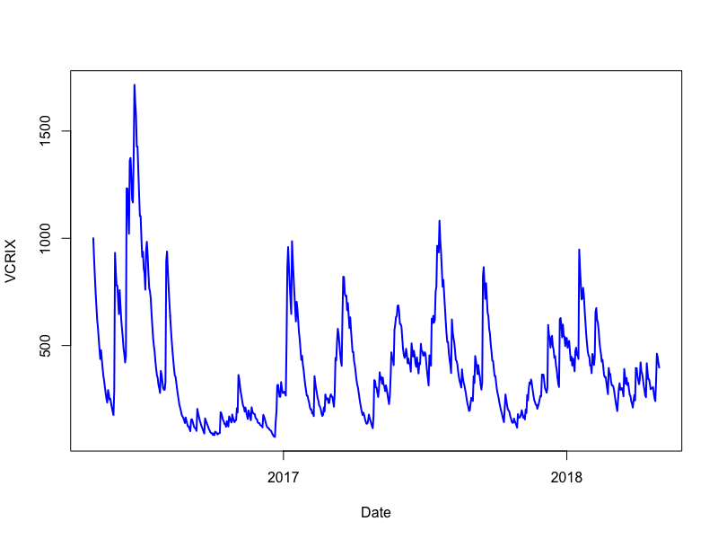

[](http://quantlet.de/)

## [](http://quantlet.de/) **VCRIXindex** [](http://quantlet.de/)

```yaml

Name of Quantlet : VCRIXindex

Published in : 'VCRIX - volatility index for crypto-currencies on the basis of CRIX'

Description : Contains the data preparation and the EWMA based derivation of VCRIX, volatility index for crypto-currencies on the basis of CRIX. 

Keywords : CRIX, VCRIX, crypto-currency, EWMA, volatility, index

See also : CRIXindex

Author : Alisa Kolesnikova

Submitted : Mon, May 23 2018 by Alisa Kolesnikova

Datafile : vcrixdata.RData

```



### R Code
```r

rm(list = ls(all = TRUE))
options(scipen = 999)

# Load data

load("vcrixdata.RData")

# install and load packages
libraries = c("lubridate", "zoo", "reshape2", "plyr", "MTS", "ggplot2")
lapply(libraries, function(x)
  if (!(x %in% installed.packages())) {
    install.packages(x)
  })
lapply(libraries,
       library,
       quietly        = TRUE,
       character.only = TRUE)


# Prepare data
data2             = data[, c("crypto_symbol", "price_usd", "date")]
data2$date        = as.Date(data2$date)
weights$date      = as.Date(weights$date)


# Ensure correct variable names
colnames(weights) = c("crypto", "weights", "date")
colnames(data2)   = c("crypto", "price", "date")


# Select relevant components

data = data2[data2$crypto %in% weights$crypto, ]
w    = weights[order(weights$crypto), ]
p    = data[order(data$crypto), ]


# Transform into time series format

wtable = reshape(  # for weights
  w,
  v.names   = "weights",
  idvar     = "date",
  timevar   = "crypto",
  direction = "wide"
)
ptable = reshape(  # for prices
  p,
  v.names   = "price", # names of variables in the long format
  idvar     = "date",    # indicating time variable
  timevar   = "crypto",
  direction = "wide"
)
ptable     = ptable[order(ptable$date), ] # alphabetic ordering of cryptos
wtable     = wtable[order(wtable$date), ] # and corresponding weights


# Ensure there are no NAs

ptable[, -1] = na.locf(ptable[, -1])


# Convert prices into returns

ret          = function(x) {
                diff(log(x))
}

returns      = colwise(ret)(ptable[, -1])
returns$date = ptable$date[-1]

returns$dat  = as.yearmon(returns$date, "%y-%m")
wtable$dat   = as.yearmon(wtable$date, "%y-%m")
wtable$date  = NULL


# Merge price and weight tables into the main dataset

ts     = merge(returns, wtable, by = "dat")
ts$dat = NULL


# Double check for missing values to avoid NA in var-covar matrix estimation

ts[, grepl("price", names(ts))] =
  na.locf(ts[, grepl("price", names(ts))])
is.na(ts) = do.call(cbind, lapply(ts, is.infinite))
ts[is.na(ts)] = 0 # otherwise EWMA will return NAs


# Estimating variance covariance matrix with EWMA
elem =
  length(grep(x = colnames(ts), pattern = "price")) # number of cryptos

# select lambda
volaest = EWMAvol(ts[, grepl("price", names(ts))], lambda = 0.82)
# estimation takes around takes 5 min


# reorganise the list of var-covar matrices
vol = volaest[1]
v   = vol[[1]]
var = c(1:nrow(ts))

vv =
  lapply(1:nrow(v), function(x)
    matrix(
      v[x, ],
      nrow  = elem,
      ncol  = elem,
      byrow = TRUE
    ))

ww =
  as.matrix(ts[, grep(x = colnames(ts), pattern = "weights")]) # selecting weights


# Plugging weights and var-covar matrix into formula

for (i in 1:nrow(ts)) {
  var[i] = as.matrix(t(ww[i, ])) %*% vv[[i]] %*% ww[i, ]
}


# Assembling vcrix dataset
index         = data.frame("vola" = sqrt(var), "date" = ts$date)
index$vcrix   = c(1:nrow(index))
index$divisor = c(1:nrow(index))
index$day     = lubridate::day(index$date)
index$month   = lubridate::month(index$date)


# Set up the re-evaluation threshold date (every first day of Feb, May, August, November)
index$recalc = 0
index$recalc = ifelse((index$day==1)&(index$month%in%c(2,5,8,11)), 1, 0)
index$day    = NULL
index$month  = NULL

# Setting the base value of VCRIX to 1000

index$vcrix[1]   = 1000
index$divisor[1] = index$vola[1] / index$vcrix[1]


# Calculating divisor

for (i in 2:nrow(index)) {
  if (index$recalc[i] == 1) {  
    index$vcrix[i] = index$vcrix[i - 1]
    index$divisor[i] = index$vola[i] / index$vcrix[i]
  } else {
    index$divisor[i] = index$divisor[i - 1]
    index$vcrix[i] = index$vola[i] / index$divisor[i]
  }
}

# Plot VCRIX

plot(
  index$date,
  index$vcrix,
  type  = "l",
  col   = "blue",
  lwd   = 2,
  xlab  = "Date",
  ylab  = "VCRIX"
)


```

automatically created on 2018-05-25
